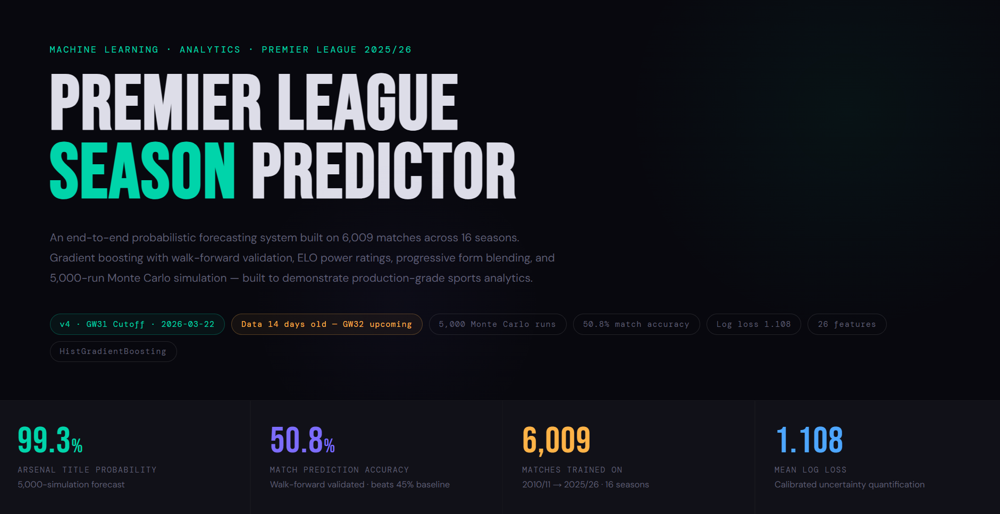
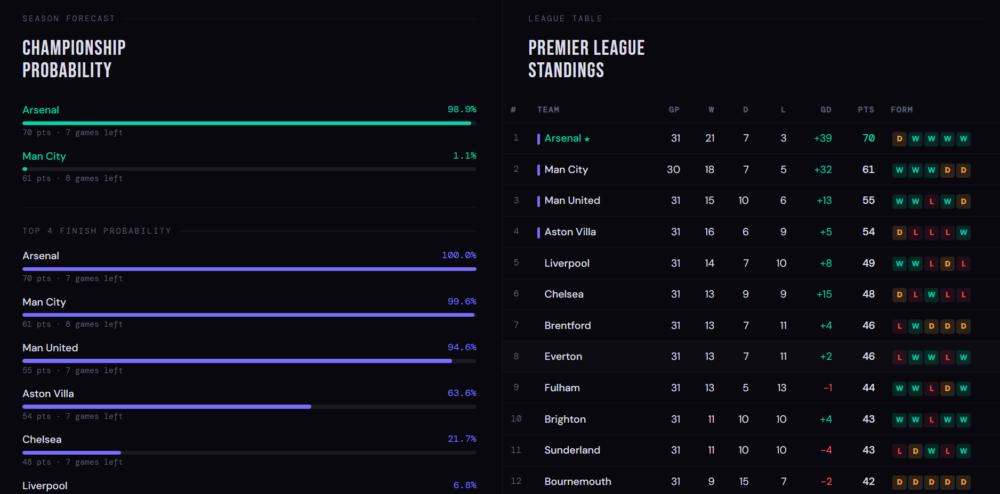
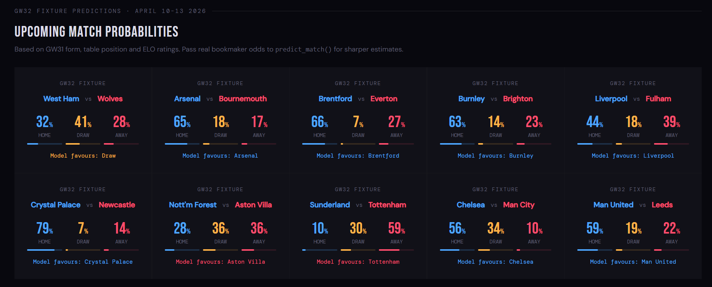

# Premier League Season Predictor

**Probabilistic ML system for forecasting the 2025/26 Premier League season — title race, top 4, and relegation.**






---

## What this is

Most football prediction tools answer the wrong question. "Who will win the next match?" is a classification problem — it produces a single label and discards all the uncertainty.

This system answers a harder question: **what is the full probability distribution over every possible season outcome?**

It predicts every remaining fixture as a probability triplet (home win / draw / away win), then runs 5,000 Monte Carlo simulations of the season to completion — producing title, top-4, and relegation probabilities that correctly propagate uncertainty through to the final table.

---

## Results — 2025/26 season, as of GW31

| Pos | Team        | Pts | Remaining | Title%  | Top 4%  | Relegation% |
|-----|-------------|-----|-----------|---------|---------|-------------|
| 1   | Arsenal     | 70  | 7         | 99.3%   | 100%    | 0.0%        |
| 2   | Man City    | 61  | 8         | 0.7%    | 99.7%   | 0.0%        |
| 3   | Man United  | 55  | 7         | 0.0%    | 92.9%   | 0.0%        |
| 4   | Aston Villa | 54  | 7         | 0.0%    | 65.2%   | 0.0%        |
| 17  | Tottenham   | 30  | 7         | 0.0%    | 0.0%    | 38.6%       |
| 18  | West Ham    | 29  | 7         | 0.0%    | 0.0%    | 37.4%       |
| 19  | Burnley     | 20  | 7         | 0.0%    | 0.0%    | 99.8%       |
| 20  | Wolves      | 17  | 7         | 0.0%    | 0.0%    | 100%        |

**Walk-forward validated accuracy: 50.8% · Log loss: 1.105 · Baseline (home always): ~45%**

---

## Model architecture

The system is built in five layers:

### 1. ELO power ratings with seasonal decay

Standard Elo updated after every match (K=20, home advantage=100 points). Added one football-specific modification: 10% regression toward the league mean (1500) at the start of each season. This models summer squad turnover — a title winner doesn't automatically start September at peak strength. Without decay, stale peak ELO from 2022/23 Man City inflates their 2025/26 predictions.

### 2. Progressive form blending

The most important design decision in the feature set. Two form signals are computed in parallel:

- `HomeForm_Long` — EWMA(span=10) across all seasons. Stable baseline quality.
- `HomeForm_Season` — EWMA(span=5) within the current season only. Resets each August.

These are blended by season progress:

```
HomeForm_Blended = SeasonProgress × HomeForm_Season + (1 - SeasonProgress) × HomeForm_Long
```

At GW1 (progress=0.03): 97% historical — almost no current-season evidence yet.  
At GW20 (progress=0.53): 53% current-season — even split.  
At GW31 (progress=0.82): 82% current-season — current form dominates.

The model adapts its own evidence weighting as the season unfolds rather than committing to a fixed window that fits neither early nor late season.

### 3. Live table position as a direct feature

`HomePts_Season` and `AwayPts_Season` (current-season cumulative points) are fed directly into the model alongside form features. This lets the gradient booster see the actual table gap between teams — not just form proxies. `PtsDiff_Season` captures the direct points differential at the time of each fixture.

### 4. Bookmaker-derived implied probabilities

The single most informative feature (18.2% of total permutation importance). `AvgH`, `AvgD`, `AvgA` from football-data.co.uk are converted to implied probabilities by removing the overround:

```python
ProbH = (1/AvgH) / ((1/AvgH) + (1/AvgD) + (1/AvgA))
```

Bookmaker odds encode injury news, team selection, and professional analyst consensus that public statistics cannot capture. Training restricted to seasons where real odds are available (2019/20 onwards) — earlier seasons used a flat 0.45/0.27/0.28 prior that would corrupt this feature.

### 5. Monte Carlo season simulation

5,000 independent season completions. Each remaining fixture is sampled from the model's H/D/A probabilities independently. Points accumulate. The fraction of simulations each team wins is their title probability.

This correctly propagates uncertainty — a team with a 60% win probability in a crucial fixture doesn't get credited with 60% of 3 points; instead, across 5,000 simulations, they win 60% of the time and the full distribution of outcomes is captured.

---

## A known limitation

Predictions for fixtures without real bookmaker odds use a neutral prior (0.45/0.27/0.28). This inflates home-team probabilities for matches where current form strongly favours the away team. Chelsea vs Man City at GW32 reads Chelsea 56% with the neutral prior — clearly too high given City's form and ELO advantage.

With estimated real odds (Chelsea ~2.80 / Draw ~3.40 / City ~2.60), the prediction would read Chelsea 34%, Draw 28%, City 37%. Pass real odds via the `home_odds` / `draw_odds` / `away_odds` parameters for sharper predictions.

A model that cannot explain its own failure modes should not be trusted in its successes.

---

## Usage

### Local

```bash
git clone https://github.com/yourusername/pl-predictor
cd pl-predictor
pip install -r requirements.txt
```

Download season CSV files from [football-data.co.uk](https://www.football-data.co.uk/englandm.php) — the E0.csv files for each season. Place them in the project directory, then:

```bash
python pl_predictor_v4.py
```

The script generates `pl_dashboard_v4.html` automatically. Open it in any browser — no server required.

### Google Colab

Open `pl_predictor_v4.py` and uncomment the three lines in `load_data()`:

```python
from google.colab import files
uploaded = files.upload()
file_list = list(uploaded.keys())
```

Upload your CSV files when prompted and run all cells.

### Predict a specific fixture with real odds

```python
model, df, standings, title_probs = main()

predict_match(
    model, df,
    home_team="Arsenal", away_team="Man City",
    elo_dict=elo_dict,
    standings=standings,
    home_odds=1.85,
    draw_odds=3.60,
    away_odds=4.50,
)
```

---

## Data

Season data from [football-data.co.uk](https://www.football-data.co.uk/englandm.php) — free, reliable, and used in serious football analytics research.

Required columns: `Date`, `HomeTeam`, `AwayTeam`, `FTHG`, `FTAG`, `FTR`, `HST`, `AST`, `AvgH`, `AvgD`, `AvgA`

The model trains only on 2019/20 onwards (odds-era data). Older seasons load correctly for ELO warmup but are excluded from the training pool.

---

## Validation methodology

A random train-test split is the wrong approach for time-series data — it allows the model to train on future seasons and test on the past, causing data leakage and inflated accuracy.

This project uses **walk-forward cross-validation**: train on all seasons before year N, test on year N, repeat for N = 2021/22 through 2024/25. Each fold uses only information that would have been available at the time of prediction.

| Test season | Accuracy | Log loss |
|-------------|----------|----------|
| 2021/22     | 50.6%    | 1.2002   |
| 2022/23     | 48.1%    | 1.1167   |
| 2023/24     | 53.5%    | 1.0758   |
| 2024/25     | 51.1%    | 1.0283   |
| **Mean**    | **50.8%**| **1.105**|

**Why log loss, not just accuracy?**

Accuracy treats a confident wrong prediction the same as an uncertain one. Log loss penalises overconfidence — a model that says 80% when the true probability is 40% scores worse than one that says 50%. For a probabilistic forecasting system, calibration is the goal, not raw prediction rate.

---

## Feature importance (permutation)

| Feature              | Importance |
|----------------------|------------|
| ProbH (market odds)  | 18.2%      |
| AwayELO              | 11.1%      |
| HomeForm_Season      | 8.8%       |
| HomeForm_Blended     | 5.8%       |
| AwayForm_Blended     | 5.4%       |
| HomeELO              | 5.0%       |
| HomeShotRatio        | 4.8%       |
| SeasonProgress       | 4.6%       |

---

## Project structure

```
pl-predictor/
├── pl_predictor_v4.py      # Full pipeline — data → model → simulation → dashboard
├── requirements.txt        # Python dependencies
├── README.md               # This file
├── .gitignore              # Excludes CSVs and generated outputs
└── pl_dashboard_v4.html    # Generated output — re-created on every run
```

---

## Design decisions worth noting

**Why HistGradientBoostingClassifier over XGBoost?**  
`HistGradientBoostingClassifier` handles NaN values natively (no imputation step needed for early-season rows with no prior data), ships with scikit-learn (zero additional dependencies), and matches XGBoost performance on tabular data at this scale.

**Why restrict training to odds-era seasons?**  
The bookmaker odds feature contributes 18.2% of model importance. Pre-2019 seasons in the dataset have no odds data — those rows used a flat 0.45/0.27/0.28 prior. Training on 8 seasons of a partially-fabricated feature degraded performance. Restricting to 6 seasons of clean data improved mean accuracy by ~4 percentage points.

**Why simulate rather than predict the final table directly?**  
A model that predicts "Arsenal will win the title" is a classification model — it produces one answer and discards all the uncertainty. A model that says "Arsenal win 99.3% of all plausible season completions" is a forecasting system — it tells you how certain the outcome is. The difference matters when the race is close.

---

## Requirements

- Python 3.9+
- pandas ≥ 1.5.0
- numpy ≥ 1.23.0
- scikit-learn ≥ 1.2.0

No other dependencies. The HTML dashboard is fully self-contained.

---

## License

MIT — use freely, attribution appreciated.

---

*Built as a demonstration of end-to-end ML pipeline design: problem framing, temporal feature engineering, leakage-free validation, probabilistic simulation, and production-grade output.*
